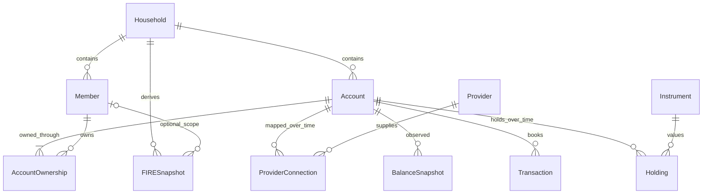

# Architecture and canonical data model

The [FIRE Dashboard Project tab](https://docs.google.com/spreadsheets/d/1pStlDjjlz6qp1908SJvJVThnQWj3SH0DzKO70mDza4g/edit?gid=944913493#gid=944913493) is authoritative. FIRE-001 establishes this domain contract; it does not expose new FIRE endpoints or persist the new entities yet.

## Existing runtime

`cmd/api` serves the Go/chi API on port 8080; React/TypeScript/Vite runs on 5173; PostgreSQL runs through Docker Compose. `pgx`, goose migrations, sqlc configuration and Makefile tooling remain. The existing users, hashed-cookie sessions, households and members are preserved. Registration still creates a household, member and legacy starter budget. This existing behaviour is not a new SaaS architecture.

`internal/domain` contains canonical financial types plus the existing auth User. `internal/legacybudget` contains the earlier budget DTOs/calculations. `internal/store` continues to serve household-scoped legacy queries; member reads now populate the already-persisted HouseholdID. `internal/httpapi` and the React app keep their existing routes and payload shapes (Member gains householdId).

## Relationships

## Entities and identity

| Concept | Contract |
| --- | --- |
| Household / Member | Existing identities retained; Member explicitly includes HouseholdID. No member names have financial meaning. |
| Account | Stable internal ID, household, display name, type, role, access class and reporting currency. No mutable current balance, provider or fund embedded. |
| AccountOwnership | Complete set of member shares per account, in integer basis points. One owner at 10,000 or arbitrary multiple owners totalling 10,000. |
| FinancialRole | Extensible nonblank configuration key; common constants include salary, spending, emergency fund, joint bills/savings, long-term investment, ISA bridge and pension. |
| AccountType | Current, savings, credit card, investment, Stocks & Shares ISA, SIPP and workplace pension. The ISA wrapper is distinct from both its platform and fund. |
| AccessClass | Accessible, pension-restricted or liability. Credit cards must be liabilities; SIPP/workplace pension must be restricted; other current types must be accessible. Future illiquid types/classes require an explicit model extension. |
| Provider | Internal identity and display name of a configurable financial provider. No provider enum. |
| ProviderConnection | One effective-dated account/provider/connector/external-account mapping, with optional product. No credentials. Historical observations reference the mapping ID. |
| BalanceSnapshot | Account balance, currency, effective AsOf, RecordedAt and provenance. A later observation adds a record, not an overwrite. |
| Instrument | Internal ID, name and optional namespaced identifiers. Ticker/ISIN are not mandatory and provider IDs are not internal IDs. |
| Holding | Account, instrument, exact decimal quantity string, valuation, effective/recording timestamps and provenance. |
| Transaction | Minimal booked entry with signed amount, description, timestamps and provenance. Pending states, categories and transfer matching are deferred. |
| FIRESnapshot | Household or optional member scope, timestamps, reporting currency, accessible/pension assets, liabilities, net worth, optional FIRE target/progress, calculation version and assumptions reference. No engine implemented. |

AccountID, ProviderID, ProviderConnectionID and InstrumentID are distinct Go types because confusing these references is meaningful. Existing household/member/user/store identifiers remain int64 to avoid auth/store signature churn. Snapshot/holding/transaction row IDs also remain int64. Positive IDs identify validated records; drafts must receive internal IDs before validation. IDs are never derived from provider identifiers.

## Ownership and historical meaning

`ValidateOwnership` validates a *complete* set against authoritative members loaded by the repository. Shares are 1..10,000, owners are unique, total ownership is exactly 10,000 and every owner belongs to the account household. A three-member split of 6,000/2,500/1,500 is valid. Membership alone never implies ownership. Validation is not authorization; the application must load members using the authenticated household boundary.

AccountOwnership describes one version of the full set. FIRE-003 must store effective-dated ownership sets before permitting ownership changes, with all rows of one version applied atomically. Historical attribution must use the set effective at AsOf, not today's owners. Account type/access/role history also needs versioning if these properties become editable; reporting currency is fixed for a given account in this initial contract. Provider migration within the same financial purpose keeps AccountID. A fundamentally different wrapper/account purpose should be a new account.

Provider mappings use `[ValidFrom, ValidTo)` intervals (nil end means ongoing). Moving an ISA from Vanguard to another platform closes the old mapping and creates a new one; historical source links retain the old mapping ID. External account strings may coincide across providers. Instruments also have independent identity: changing VALL to another fund creates a later Holding referencing a new InstrumentID while leaving AccountID alone.

## Money, quantities and signs

`Money` remains int64 minor units. Canonical `Amount` pairs Money with an explicit Currency and serializes as `{"minorUnits":12345,"currency":"GBP"}`. This avoids decimal scaling and preserves exact int64 JSON values in Go. Future JavaScript consumers must decode integers beyond Number's safe range with an exact-number strategy. No canonical consumer exists yet.

Currency validation checks three uppercase letters, not a maintained ISO registry. Connector/configuration code must validate supported codes and use their minor-unit exponent (GBP pence, JPY yen, KWD fils, etc.). Account observations must use the account reporting currency. FIRE metrics use one declared reporting currency; aggregating different currencies needs an explicit future conversion policy and rate provenance. No conversion or unchecked cross-currency arithmetic is supplied.

Bare Money retains decimal pounds JSON for the existing GBP API only. Parsing/formatting are exact, including int64 extremes; sub-penny and overflowing inputs are rejected. Floating-point Pounds/Float64 helpers were removed and the development seed uses integer pence. Money.String is legacy GBP display, not canonical multicurrency display. Arithmetic overflow checks remain the responsibility of future calculation code.

Balance and transaction amounts use signed net value: assets/inflows positive, debt/outflows negative. An overdrawn current account may have a negative balance; an overpaid credit card may have a positive balance. Access classification does not negate the balance again. Derived FIRESnapshot asset/debt totals are nonnegative magnitudes and net worth is signed. The engine must handle overdrafts, avoid counting holdings on top of an inclusive account balance, and avoid double-counting joint accounts. FIRE progress is integer basis points, may exceed 10,000, and needs a positive target. Uncomputed target/progress are nil, not zero. Calculation equations and rounding policies belong to FIRE-005.

Holding quantities are nonnegative decimal strings, with no float or portfolio accounting engine. Persist as NUMERIC; retain precision. Valuations are nonnegative in the account reporting currency. Short positions and tax lots are out of scope.

## Validation and snapshot strategy

Go structs are plain values, not immutable objects. Call their Validate methods at ingestion/service boundaries before persistence; the model does not silently validate all assignments or JSON decoding. Preserve observations as append-only records once accepted. `Amount` decoding also validates its wire form.

BalanceSnapshot, Holding and Transaction require account association, matching currency, nonzero timestamps and RecordedAt >= AsOf/BookedAt. Holdings require an investment-capable account and matching valid instrument. ObservationSource requires a nonblank source kind (manual/import/connector key) and a positive connection ID if present. AsOf is effective financial time; RecordedAt is ingestion time. Preserve instants using TIMESTAMPTZ; connectors should normalize to UTC. Do not infer history from a mutable account field or reuse the legacy monthly Snapshot.

FIRESnapshot validates scope against household members, metric currencies, timestamps, nonnegative component totals, optional target/progress and nonblank calculation/assumptions references. These references must identify retained immutable calculation inputs/configuration in the later engine. Formula correctness, input balance selection and completeness/staleness checks belong to FIRE-005. A derived result does not itself provide an audit trail of every input record.

## FIRE-003 persistence boundary

Do not rewrite migrations 0001/0002. Add tables for accounts, ownership versions/rows, providers, provider connections, balance snapshots, instruments/identifier mappings, holdings, transactions and FIRE snapshots using the existing household/member keys. Keep auth tables intact.

Use BIGINT for IDs/minor units, currency codes, NUMERIC for quantities, TIMESTAMPTZ for observation/mapping times, and nullable member keys for household FIRE results. Index account/time and household/time queries. Persist the source kind, connection and external record ID separately from internal primary keys.

Database/service responsibilities deliberately not enforced by a single record's Validate method:

- Actual household/account/member/provider/instrument/connection existence, authentication and foreign-key enforcement.
- Composite household constraints so ownership and FIRE member scope cannot cross households.
- Atomic ownership-set totals, effective ownership intervals and mapping-overlap policy. Do not simply update past shares.
- Source connection belongs to the observation account and was valid at effective time, even if now closed; retain referenced mappings.
- Provider/connector-scoped external-ID uniqueness, replay/idempotency and correction semantics (a correction adds provenance, never silently overwrites history).
- Complete holdings observations: a later full portfolio needs a batch/completeness boundary so absent/sold instruments do not remain as stale holdings. FIRE-015 owns ingestion semantics; never sum the latest row of each instrument without this boundary.
- Reliable historical configuration/calculation references and safe arithmetic/aggregation.

The unused `db/queries/swaledale.sql` templates predate household-scoped auth and are not used by PostgresStore. They must be brought up to the same household boundary before generated queries are adopted (follow-up FIRE-028). No schema or generated query rollout occurs here.

## Legacy disposition

| Legacy type/file | Decision |
| --- | --- |
| Household, Member, Money | Retained/refactored in domain; explicit member household and canonical currency-qualified Amount added. |
| User, users/sessions, HTTP auth | Retained as existing working infrastructure. |
| IncomeEntry, BudgetItem, AllocationRule, Goal | Moved to legacybudget for active budget endpoints. Allocation labels are display data only. |
| JointAccountItem, JointContribution, MemberBudget, JointAccount, Summary | Moved to legacybudget to preserve current React/API contracts. These are budget DTOs, not canonical financial accounts. |
| Spreadsheet Snapshot and budget calculations | Moved to legacybudget. Spendable income now consistently equals income minus bills and savings; name/label branches removed. Per-person estimates divide by actual household size, not two. |
| BudgetCategory Go type | Removed: unused. Existing database categories remain necessary for active budget queries. |
| Existing migrations/seed/frontend | Retained; seed is explicitly legacy fixture data. Person/provider names in fixtures have no business logic significance. Seed money literals converted to integer pence. |
| jira-backlog.md | Removed; superseded by the Google Sheets backlog. Historical spreadsheet audit retained and labelled. |

Legacy per-person figures are rounded equal-share display estimates, not an allocation ledger; rounding can leave a penny difference. Actual contributions remain explicit records. FIRE ownership is independent. Retirement of this compatibility API and its React budget screens requires a deliberate management-UI transition (FIRE-027), not deletion of working routes in FIRE-001.

## Non-goals

No migrations, connectors, pricing feeds, Grafana setup, forecasting, categorisation, tax modelling, pension access ages, AWS/Terraform, SaaS administration, auth redesign, frontend redesign, complex securities accounting or provider optimisation. Follow the Sheets backlog for those capabilities.
